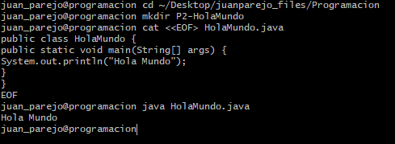

## Practica 2 Hola Mundo:

- Vamos a crear un archivo .java y a compilarlo a través del bash
- Para crearlo deberemos irnos al notepad++ y luego lo copiaremos a nuestra carpeta y lo modificaremos con un cat y lo compilaremos con la sentencia java HolaMundo.java 
- Se ha hecho para sacar por pantalla el mensaje "Hola Mundo"
- Se he hecho en el IES Castelar por el alumno Juan Parejo y se ha finalizado el día jueves 13 de Octubre de 2022

